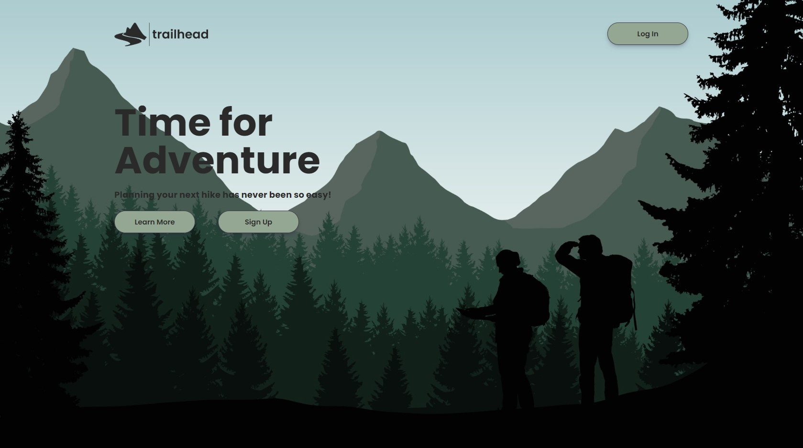
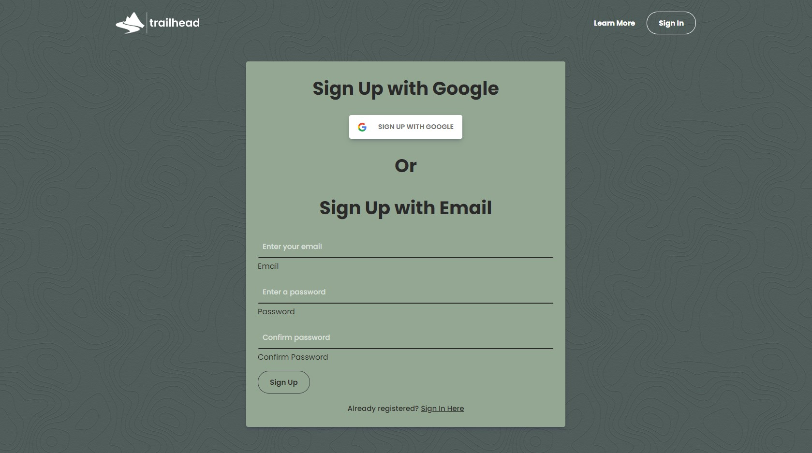
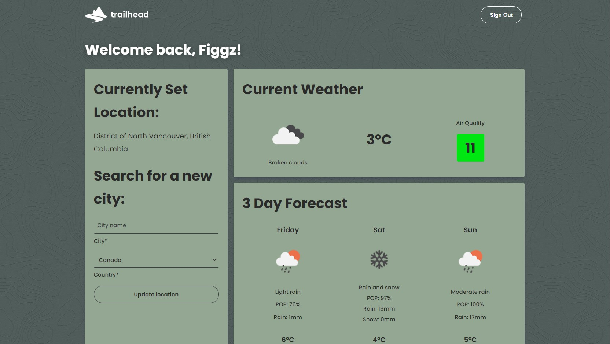
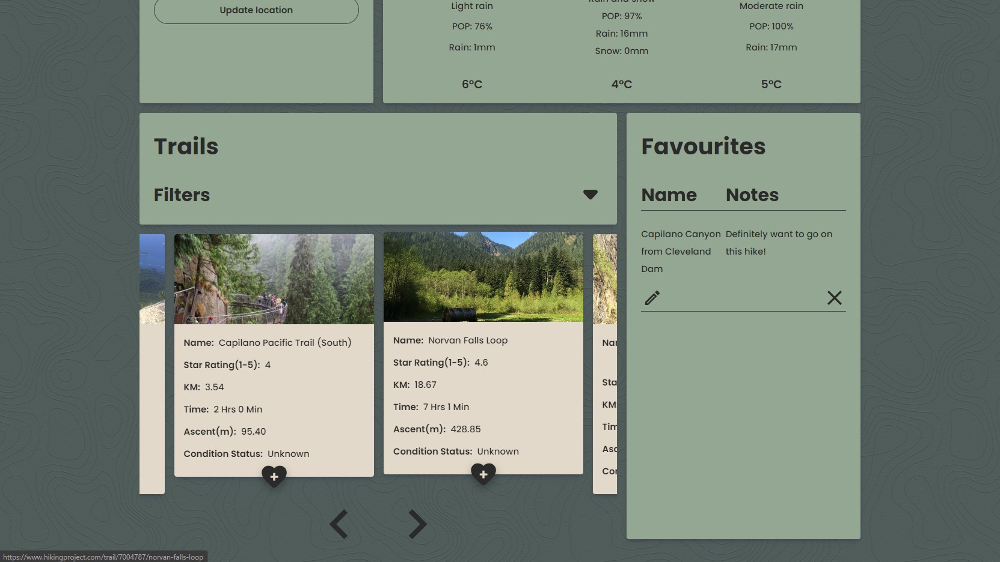
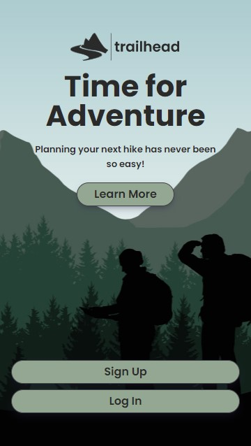

# trailhead

## Accessing Application

The app is deployed and can be accessed by visiting: [https://trailhead-capstone.herokuapp.com/](https://trailhead-capstone.herokuapp.com/)

## Overview

trailhead is a single page application that aims to be a users "one stop shop" dashboard for planning out a day hike. 

The app was built as my Capstone project for the BrainStation program over a 2.5 week period and presented on the final demo day. You can view my presentation on the [BrainStation Graduate Page](https://brainstation.io/hiring-brainstation-graduates), search for "Jimmy Figliomeni" under the Web Development tab. 

The project uses an API which has since been deprecated and is no longer issuing new API keys. As such, this project cannot be run locally if a key is not already obtained for the [Hiking Project API](https://www.hikingproject.com/data).

## Motivation
One weekend, I was trying to decide on what hike to go on for the day. I spent the morning planning out the relevant details before a day hike: weather in current and hiking location, air quality, driving distance, hiking distance (km/time), whether I'd completed the hike previously and what I liked about it. It took way too long and I had to repeatedly check multiple different websites. This is where trailhead positions itself and aims to be a quick and easy solution to provide a user with all this information in a concise dashboard format.

Given that this application was developed as a Capstone project for the BrainStation course, I also had a number of learning objectives to further expand my working knowledge of modern industry technologies. I defined and achieved the following learning objectives:
1. Learn an alternative different backend framework to REST
2. A new modern ORM/Query builder for a MySQL database
3. Local and OAuth authentication

### Key Challenges:
I encountered and overcame the following key challenges when developing this application.
1. Learning how to use GraphQL Queries and Mutations to manage server access in conjunction with Apollo Client on the frontend.
2. Using local and OAuth authentication methods on a single GraphQL endpoint.
3. Creating a web application that had the feel of an application, responsively across a wide range of devices.
4. Handling validation on the frontend for the various forms throughout the sites including setting up appropriate returned values from GraphQL queries.
5. Handling data validation on the backend to ensure alignment with stored values in the database and query values for the APIs.
6. Serving data to the frontend from three separate APIs and a database.

### Key Takeaways and Final Thoughts:
Overall, I really had an amazing time working on this project and implementing everything I learned at BrainStation in combination with my personally set learning objectives. Prior to this project, I had experience with REST backend architecture, however, learning how to use GraphQL through a single endpoint was very interesting and incredibly efficient! In addition to this, learning how to implement local and OAuth authentication through a single GraphQL endpoint while maintaining a session on the server with Express Session was a challenge that I enjoyed overcoming. Lastly, I had basic working knowledge of MySQL and utilizing Prisma as my ORM really bridged that gap and allowed me to further understand how to create complex MySQL queries, joining multiple tables and information.

As this was my capstone project, I have decided to no longer maintain or add additional features to this project. 

If you have any questions about the project or would like to contact me, please reach out to me on [LinkedIn](https://www.linkedin.com/in/jimmy-figliomeni/)!

## Tech/Frameworks Used
**Built with:**
- React
- SASS (SCSS)
- Apollo Client
- GraphQL
- React Router
- Prisma
- MySQL
- Node
- Passport (Local and Google Auth Strategies)

## Screenshots

## How To Run
**Project cannot be locally installed with full functionality due to deprecated API.**

## Contribute
This project was developed as a learning project and will not be maintained going forward.

## License
GPL-3.0 License © [Jimmy Figliomeni]()
